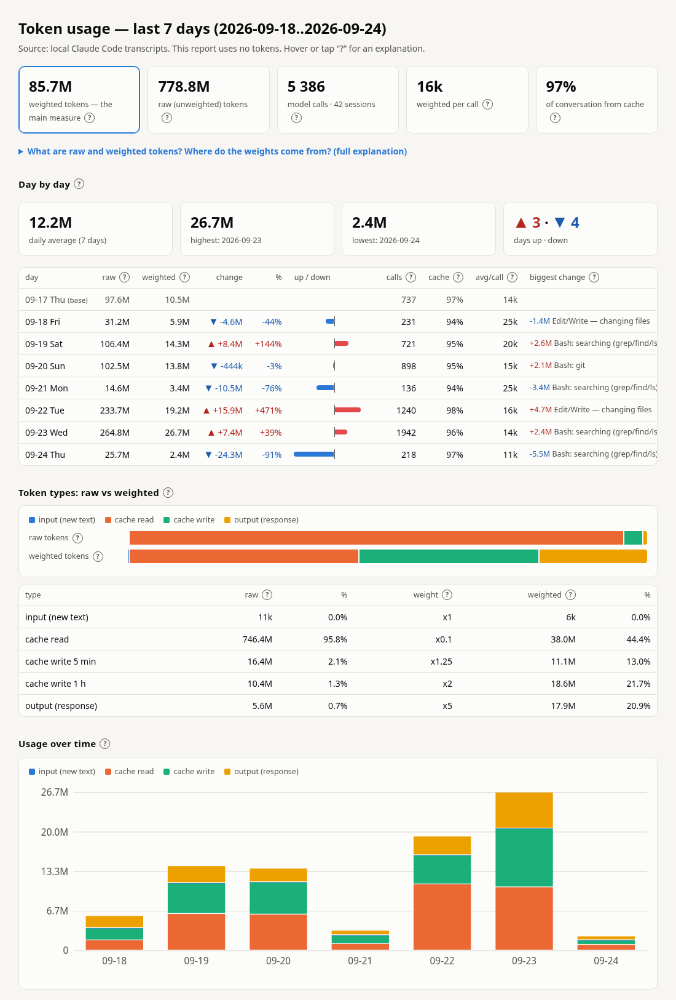

# claude_token_report

Shows **where your Claude Code tokens actually go**: which activities (reading files, searching,
editing, git, subagents...), which models, projects and sessions. It also shows how much long
conversations and an expired cache add to your usage.

- reads only local transcripts (`~/.claude/projects/**/*.jsonl`)
- sends nothing and calls no API, so it uses **0 tokens**
- Python 3.8+, standard library only, no dependencies
- English by default, Polish with `-l pl`

## Example

Real usage from one week, with project names, file names and prompts hidden (`--private`).

**Terminal** (`claude-token-report --daily --private`, the beginning):

```
============================================================================================
 CLAUDE CODE TOKEN USAGE — last 7 days (2026-09-18..2026-09-24)
 source: local transcripts ~/.claude/projects  (this report uses 0 tokens)
============================================================================================
 model calls                      5 386   42 conversations, 88 subagents
 raw tokens                      778.8M   all tokens counted equally
 weighted tokens                  85.7M   main measure — load on your limit (--explain)
 cache hit rate                   96.5%   above ~90% is good
 average per call                   16k   weighted; avg context 144k

-- TOKEN TYPES — raw vs weighted -----------------------------------------------------------
 token type                      raw      %  weight  weighted      %
 input (new text)                11k   0.0%      x1        6k   0.0%
 cache read                   746.4M  95.8%    x0.1     38.0M  44.4%
 cache write 5 min             16.4M   2.1%   x1.25     11.1M  13.0%
 cache write 1 h               10.4M   1.3%      x2     18.6M  21.7%
 output (response)              5.6M   0.7%      x5     17.9M  20.9%
 TOTAL                        778.8M                    85.7M
   Weighted also includes the model's weight (see MODELS).

-- WHERE THE TOKENS GO ---------------------------------------------------------------------
   Each call is assigned to the tool the model used in it (split evenly if it used
   several). 'No tool' = the model replied to you with text. 'avg' = the average weight of
   one use.
 activity                              raw  weighted      %    uses      avg  
 Bash: searching (grep/find/ls)     190.4M     19.9M  23.2%    1580      13k  #####...............
 Edit/Write — changing files        163.7M     15.2M  17.7%    1177      13k  ####................
 Read — reading files               162.4M     14.6M  17.1%    1738       8k  ###.................
 Bash: scripts (python/node/sh/o     66.5M      7.5M   8.8%     518      15k  ##..................
 Bash: git                           57.9M      6.9M   8.1%     499      14k  ##..................
 (no tool) text reply                45.9M      5.9M   6.9%     278      21k  #...................
 Bash: reading (cat/head/sed)        32.8M      5.3M   6.2%     274      19k  #...................
 Agent — launching a subagent        10.8M      3.3M   3.9%     161      21k  #...................
 Bash: devices (adb/emulator/xcr     10.6M      1.6M   1.9%      96      17k  ....................
 Skill                                6.7M      1.4M   1.7%      79      18k  ....................
 Bash: other                          4.1M      797k   0.9%      32      25k  ....................
 Bash: file operations                6.2M      767k   0.9%      44      17k  ....................
 asking the user                      3.6M      562k   0.7%      22      26k  ....................
 Bash: processes/waiting (ps/sle      1.5M      383k   0.4%      11      35k  ....................
 Bash: browser automation             5.1M      360k   0.4%      48       8k  ....................
 Bash: gh (GitHub/GitLab CLI)         1.2M      360k   0.4%      19      19k  ....................
 (other: 7)                           9.5M      666k   0.8%
```

<details>
<summary>The whole terminal report</summary>

```

-- DAY BY DAY — change vs the previous day -------------------------------------------------
 day                    raw   weighted    change      %   calls  cache  avg/call  biggest change
 09-17 Thu (base)     97.6M      10.5M                      737    97%       14k
 09-18 Fri            31.2M ▼     5.9M     -4.6M   -44%     231    94%       25k  -1.4M Edit/Write — changing files
 09-19 Sat           106.4M ▲    14.3M     +8.4M  +144%     721    95%       20k  +2.6M Bash: searching (grep/find/ls)
 09-20 Sun           102.5M ▼    13.8M     -444k    -3%     898    95%       15k  +2.1M Bash: git
 09-21 Mon            14.6M ▼     3.4M    -10.5M   -76%     136    94%       25k  -3.4M Bash: searching (grep/find/ls)
 09-22 Tue           233.7M ▲    19.2M    +15.9M  +471%    1240    98%       16k  +4.7M Edit/Write — changing files
 09-23 Wed           264.8M ▲    26.7M     +7.4M   +39%    1942    96%       14k  +2.4M Bash: searching (grep/find/ls)
 09-24 Thu            25.7M ▼     2.4M    -24.3M   -91%     218    97%       11k  -5.5M Bash: searching (grep/find/ls)

 daily average 12.2M   highest 2026-09-23 (26.7M)   lowest 2026-09-24 (2.4M)   days ▲ 3 / ▼ 4
   Changes in weighted tokens. ▲ = more than the day before, ▼ = less, = unchanged (±1%).
   'biggest change' = the activity whose usage changed the most.

============================================================================================
 CLAUDE CODE TOKEN USAGE — last 7 days (2026-09-18..2026-09-24)
 source: local transcripts ~/.claude/projects  (this report uses 0 tokens)
============================================================================================
 model calls                      5 386   42 conversations, 88 subagents
 raw tokens                      778.8M   all tokens counted equally
 weighted tokens                  85.7M   main measure — load on your limit (--explain)
 cache hit rate                   96.5%   above ~90% is good
 average per call                   16k   weighted; avg context 144k

-- TOKEN TYPES — raw vs weighted -----------------------------------------------------------
 token type                      raw      %  weight  weighted      %
 input (new text)                11k   0.0%      x1        6k   0.0%
 cache read                   746.4M  95.8%    x0.1     38.0M  44.4%
 cache write 5 min             16.4M   2.1%   x1.25     11.1M  13.0%
 cache write 1 h               10.4M   1.3%      x2     18.6M  21.7%
 output (response)              5.6M   0.7%      x5     17.9M  20.9%
 TOTAL                        778.8M                    85.7M
   Weighted also includes the model's weight (see MODELS).

-- WHERE THE TOKENS GO ---------------------------------------------------------------------
   Each call is assigned to the tool the model used in it (split evenly if it used
   several). 'No tool' = the model replied to you with text. 'avg' = the average weight of
   one use.
 activity                              raw  weighted      %    uses      avg  
 Bash: searching (grep/find/ls)     190.4M     19.9M  23.2%    1580      13k  #####...............
 Edit/Write — changing files        163.7M     15.2M  17.7%    1177      13k  ####................
 Read — reading files               162.4M     14.6M  17.1%    1738       8k  ###.................
 Bash: scripts (python/node/sh/o     66.5M      7.5M   8.8%     518      15k  ##..................
 Bash: git                           57.9M      6.9M   8.1%     499      14k  ##..................
 (no tool) text reply                45.9M      5.9M   6.9%     278      21k  #...................
 Bash: reading (cat/head/sed)        32.8M      5.3M   6.2%     274      19k  #...................
 Agent — launching a subagent        10.8M      3.3M   3.9%     161      21k  #...................
 Bash: devices (adb/emulator/xcr     10.6M      1.6M   1.9%      96      17k  ....................
 Skill                                6.7M      1.4M   1.7%      79      18k  ....................
 Bash: other                          4.1M      797k   0.9%      32      25k  ....................
 Bash: file operations                6.2M      767k   0.9%      44      17k  ....................
 asking the user                      3.6M      562k   0.7%      22      26k  ....................
 Bash: processes/waiting (ps/sle      1.5M      383k   0.4%      11      35k  ....................
 Bash: browser automation             5.1M      360k   0.4%      48       8k  ....................
 Bash: gh (GitHub/GitLab CLI)         1.2M      360k   0.4%      19      19k  ....................
 (other: 7)                           9.5M      666k   0.8%

-- MODELS ----------------------------------------------------------------------------------
   'weight' = how heavily the model uses the limit relative to Opus 5 (x1). The same work
   on a x0.4 model uses 2.5 times less.
 model                                 raw  weighted      %   calls      avg weight  
 claude-opus-5                      146.4M     36.6M  42.7%     859      43k     x1  #########...........
 claude-sonnet-5                    511.8M     32.4M  37.9%    3517       9k   x0.4  ########............
 claude-opus-5-5                    120.6M     16.7M  19.5%    1010      17k   x0.8  ####................

-- MAIN SESSION vs SUBAGENTS ---------------------------------------------------------------
   Subagents are separate Claude instances started with the Agent tool. They have their own
   context, so their work doesn't grow the main conversation.
 where                                 raw  weighted      %   calls      avg  
 main session                       245.4M     43.4M  50.6%    1617      27k  ##########..........
 subagents                          533.5M     42.3M  49.4%    3769      11k  ##########..........

-- SUBAGENTS BY TYPE -----------------------------------------------------------------------
 subagent type                         raw  weighted      %   calls      avg  
 agent-3                            409.0M     31.5M  36.7%    2495      13k  #######.............
 general-purpose                     86.9M      6.8M   7.9%     898       8k  ##..................
 fork                                14.7M      1.5M   1.7%     127      12k  ....................
 agent-2                              7.1M      1.4M   1.6%      75      18k  ....................
 agent-1                             15.8M      1.2M   1.4%     174       7k  ....................

-- PROJECTS (working directory) ------------------------------------------------------------
 project                               raw  weighted      %   calls      avg  
 project-1                          749.9M     81.9M  95.6%    5198      16k  ###################.
 project-3                           15.3M      2.0M   2.4%     116      18k  ....................
 project-2                           13.6M      1.8M   2.1%      72      24k  ....................

-- CONVERSATION LENGTH — weight of a call by context size ----------------------------------
   Context = the whole conversation the model reads in a call. It grows with every step and
   the model re-reads it every time, so the longer the conversation, the more each further
   call weighs.
 context          calls       raw  weighted      %    avg/call   of it reading
 < 50k              267     11.3M      3.4M   4.0%         13k              1k
 50-100k           1803    140.8M     17.6M  20.5%         10k              3k
 100-200k          2188    311.1M     31.9M  37.2%         15k              7k
 200-300k           795    191.6M     17.7M  20.7%         22k             12k
 300k+              333    124.0M     15.1M  17.7%         45k             21k
   A call at 300k+ context weighs 4.7x as much as one at 50-100k on average. 'of it
   reading' = the part spent only on re-reading the conversation. The '< 50k' group is
   often conversation starts, which first write everything to the cache.

-- OVER TIME — days ------------------------------------------------------------------------
 period                          raw  weighted      %   calls  
 2026-09-18 Fri                31.2M      5.9M   6.8%     231  ######....................
 2026-09-19 Sat               106.4M     14.3M  16.7%     721  ##############............
 2026-09-20 Sun               102.5M     13.8M  16.2%     898  #############.............
 2026-09-21 Mon                14.6M      3.4M   3.9%     136  ###.......................
 2026-09-22 Tue               233.7M     19.2M  22.5%    1240  ###################.......
 2026-09-23 Wed               264.8M     26.7M  31.1%    1942  ##########################
 2026-09-24 Thu                25.7M      2.4M   2.8%     218  ##........................

 trend of top activities (weighted tokens):
                                            09-18   09-19   09-20   09-21   09-22   09-23   09-24
 Bash: searching (grep/find/ls)              958k    3.5M    4.2M    808k    3.7M    6.1M    599k
 Edit/Write — changing files                 797k    2.9M    1.5M    137k    4.8M    4.8M    286k
 Read — reading files                        981k    2.8M    2.4M    292k    3.7M    4.1M    401k
 Bash: scripts (python/node/sh/own)          747k    873k    754k    757k    858k    3.2M    322k
 Bash: git                                   170k    347k    2.4M     55k    1.2M    2.6M    105k
 (no tool) text reply                        576k    880k    349k    636k    1.5M    1.7M    208k

-- HEAVIEST CONVERSATIONS ------------------------------------------------------------------
 session   project                    raw  weighted      %  calls  max ctx    sub  topic
 f2aff469  project-1               298.4M     22.4M  26.2%   1539     424k    69%  
 7069c87d  project-1               103.5M     13.5M  15.8%    715     290k    70%  
 518f740c  project-1                34.3M      7.2M   8.4%    238     465k    35%  
 6b14de2f  project-1                50.9M      4.1M   4.8%    536      49k   100%  
 d59ca19f  project-1                18.8M      3.9M   4.5%     44     465k     0%  
 950df66a  project-1                20.0M      3.8M   4.4%    124     262k     0%  
 beea9669  project-1                14.0M      2.5M   2.9%    124     158k    68%  
 576b5390  project-1                38.5M      2.1M   2.4%    222     275k     0%  
 85b54a3a  project-1                22.1M      2.0M   2.4%    180     246k    45%  
 29d533c5  project-1                13.7M      1.9M   2.3%    118     155k    69%  
   'max ctx' = how large the conversation grew; 'sub' = the share of this session's usage
   spent by subagents. One session in detail: --session <id>

-- EXPIRED CACHE — conversation written again ----------------------------------------------
   The cache keeps the conversation for 5 minutes (sometimes an hour) after its last use.
   After a longer break the model has to write the whole conversation again (weight x1.25)
   instead of reading it cheaply (x0.1).
 such calls: 67   extra usage: 12.9M (15.1% of the total)
    2026-09-20 20:05  d59ca19f  ctx  435k  gap   67 min  extra 767k
    2026-09-19 15:23  518f740c  ctx  410k  gap 1662 min  extra 737k
    2026-09-23 08:11  f2aff469  ctx  410k  gap  234 min  extra 736k
    2026-09-18 11:37  518f740c  ctx  367k  gap    1 min  extra 653k
    2026-09-23 03:11  f2aff469  ctx  359k  gap  214 min  extra 640k

-- REPEATED FILE READS (Read tool) ---------------------------------------------------------
 reads: 1738, part already in the conversation: 197 (11%)
    file-38.md                                          +32
    file-4.md                                           +19
    file-34.kt                                          +13
    file-41.kt                                          +11
    file-35.kt                                          +9
    file-5.md                                           +7

-- WHAT YOU COULD IMPROVE ------------------------------------------------------------------
 * Long conversations: calls with more than 200k of context are 38% of usage, and each of
   them weighs more than a call in a short conversation (~4.7x). Start unrelated tasks with
   /clear and shorten long work with /compact.
 * Expired cache: 67 times the whole conversation was written again (usually after a break
   of more than 5 minutes). That is 15% of usage that could have been avoided. Finish the
   thread before a long break, and consider /compact or /clear when you return to an old
   conversation.
 * Searching and reading code is 47% of usage. Name concrete files or functions in your
   request, describe the project layout in CLAUDE.md, and hand broad searches to a subagent
   (e.g. "use a subagent to find…"). Its working reads stay out of the main conversation;
   only the result comes back.

 Full explanation of raw and weighted tokens: --explain
============================================================================================
```

</details>

**HTML** (`--html report.html`), the top of the page; every number has a `?` with an explanation:



## Install

Works on Linux, macOS and Windows, anywhere Claude Code keeps its transcripts in
`~/.claude/projects` (on Windows `%USERPROFILE%\.claude\projects`).

**As a command** (recommended), with [pipx](https://pipx.pypa.io) or [uv](https://docs.astral.sh/uv/):

```bash
pipx install git+https://github.com/dgrebowiec/claude-token-report
# or: uv tool install git+https://github.com/dgrebowiec/claude-token-report
claude-token-report --help
```

Update with `pipx upgrade claude-token-report` (or `uv tool upgrade claude-token-report`);
`claude-token-report --version` shows which version you have.
Try it once without installing: `uvx --from git+https://github.com/dgrebowiec/claude-token-report claude-token-report`

**Or just clone it**, since there is nothing to install:

```bash
git clone https://github.com/dgrebowiec/claude-token-report.git
cd claude-token-report
python3 claude_token_report.py --help
```

The examples below use `python3 claude_token_report.py` (on Windows usually `py claude_token_report.py`);
with pipx/uv just type `claude-token-report` instead.

## Usage

```bash
python3 claude_token_report.py                  # last 7 days in the terminal
python3 claude_token_report.py --explain        # what raw and weighted tokens mean
python3 claude_token_report.py --days 14 --daily         # last 14 days + each day's rise/fall
python3 claude_token_report.py --date 2026-09-15         # one specific day
python3 claude_token_report.py --from 09-01 --to 09-15   # a date range (inclusive)
python3 claude_token_report.py --today --diff   # today vs yesterday
python3 claude_token_report.py -l pl            # Polish
python3 claude_token_report.py --list           # recent sessions
python3 claude_token_report.py --session 1a2b   # one session, usage per request
python3 claude_token_report.py --html report.html --private   # shareable HTML, no names or prompts
```

Dates: `YYYY-MM-DD`, `DD.MM.YYYY`, `MM-DD` (current year), `today`, `yesterday`.

`--daily` compares every day with the day before it: the change in weighted tokens (▲/▼), cache hit rate,
usage per call and the activity that changed the most. It works in the terminal and in the HTML report.
In the HTML report every metric has a `?` you can hover over or tap for an explanation.

## Two measures

This report is for Claude **subscriptions** (Pro/Max), so it shows no money, only tokens.

| measure | what it is |
|---|---|
| **raw tokens** | all text that went through the model, every token counted the same. The model re-reads the whole conversation on every call, so this is huge and mostly cheap cache reads. |
| **weighted tokens** | the main measure: each token counted by how heavily it uses your limit. Cache read x0.1, new input x1, cache write x1.25 (5 min) / x2 (1 h), output x5, times the model weight (Opus 5 x1, Opus 5.5 x0.8, Sonnet 5 x0.4, Haiku 4.5 x0.2, Fable 5.x x2). |

The weights are the price ratios from Anthropic's public API pricing. Anthropic does not publish the formula
behind subscription limits, so the report assumes limits count tokens in the same proportions. That is an
approximation, not an official number. Run `--explain` for the full explanation with a worked example.

The weights live in the price table in `token_report/pricing.py` (as of 2026-09). Only the ratios matter.
Models missing from the table are counted as Opus 5 (the report lists them).

Official sources for the prices and the cache durations (5 minutes / 1 hour):

- [Pricing](https://platform.claude.com/docs/en/about-claude/pricing): per-model prices, including
  5-minute cache writes (1.25x input), 1-hour cache writes (2x) and cache reads (0.1x)
- [Prompt caching](https://platform.claude.com/docs/en/build-with-claude/prompt-caching): how the
  cache works and how long an entry lives (every read refreshes it)

## Development

`claude_token_report.py` is only a launcher; the code is in the `token_report/` package:

| module | what it does |
|---|---|
| `transcripts.py` | reads the `.jsonl` transcripts into `Call` and `SessionMeta` objects |
| `pricing.py` | token types, model prices and weights |
| `classify.py` | which activity a call belongs to (tool, kind of shell command) |
| `stats.py` | aggregates calls into `Stats` (by activity, model, project, day, context size...) |
| `daily.py`, `tips.py` | the `--daily` comparison and the suggestions |
| `periods.py` | `--days/--date/--from...` time windows |
| `report_text.py`, `report_html.py` | the two reports (HTML styles and script in `assets/`) |
| `cli.py` | command line options, ties it all together |

Releasing: bump `__version__` in `token_report/__init__.py` (the only place the version lives).
`pipx upgrade` compares version numbers, so without a bump it keeps the old code
(`uv tool upgrade` follows the latest commit either way).

Tests use only the standard library:

```bash
python3 -m unittest
```

## License

[MIT](LICENSE)
